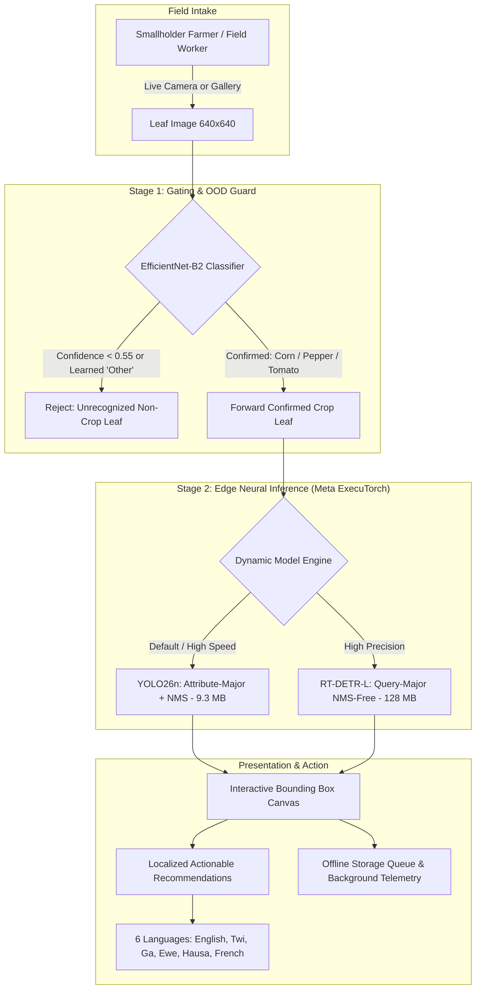

# Crop Disease Detection Mobile Application

[](#)
[](#)
[](#)
[](#)
[](#)
[](#)
[](#)

Production-grade, offline-first **Kotlin Multiplatform (Compose Multiplatform)** mobile application for real-time agricultural disease diagnosis in West African staple crops.

---

## 📖 System Overview

The **Crop Disease Detection Mobile Application** is a field-deployable diagnostic tool designed to combat crop loss among smallholder farmers in West Africa. Agricultural plant diseases reduce yields in staple crops by **30% to 50%**, while the agricultural extension officer-to-farmer ratio in Ghana exceeds **1:1,500 to 1:3,000**, leaving rural farmers without timely, expert agronomic advice.

To overcome the twin barriers of **zero cellular connectivity in rural fields** and **non-English literacy**, this application pairs on-device neural edge computing with native indigenous language localization.



### Key Capabilities

* **100% On-Device Neural Inference:** Powered by **Meta ExecuTorch**, running ahead-of-time (AOT) compiled `.pte` models directly on mobile silicon with zero server dependence and sub-100ms latency.
* **Two-Stage Hallucination Guard:** Eliminates false alarms on weeds, soil, clothing, or unrelated leaves (e.g. mango, cassava) through an **EfficientNet-B2** gating stage with **98.74% out-of-distribution rejection**.
* **Dual Edge Detection Engines:** Dynamically switch between **YOLO26n** (9.3 MB, ultra-fast baseline) and **RT-DETR-L** (128 MB, transformer accuracy of 0.345 mAP@0.5) from application settings.
* **Indigenous Localization in 6 Languages:** Delivers culturally attuned disease names and treatment protocols in **English**, **Twi (Akan)**, **Ga**, **Ewe**, **Hausa**, and **French**.
* **Actionable 3-Tier Agronomy:** Every diagnosis links directly to verified symptoms, zero-cost organic/cultural prevention practices, and safe chemical management guidelines (active ingredients, dilution ratios, and Pre-Harvest Intervals).
* **Offline-First Architecture & Active Learning:** Persistent local queues (`OfflineQueueStore.kt`) save all field scans offline, synchronizing to Firebase and Cloudinary when connectivity returns, with a built-in **Human-in-the-Loop Flagging System** for continuous model improvement.

---

## 🏛 Architecture & Technology Stack

The mobile client is engineered using a clean, modern **Kotlin Multiplatform (KMP)** layered architecture where over 90% of business logic, presentation state, and data management is shared in `commonMain`:

```text
app/src/
├── commonMain/kotlin/com/nkwabyte/cropdiseasedetection/
│   ├── common/
│   │   ├── data/                      ← Multi-language disease encyclopedia & advice
│   │   │   ├── DiseaseDatabase.kt     ← Core disease profiles for 23 classes
│   │   │   ├── TwiDiseaseText.kt      ← Akan / Twi translations
│   │   │   ├── GaDiseaseText.kt       ← Ga translations
│   │   │   ├── EweDiseaseText.kt      ← Ewe translations
│   │   │   ├── HausaDiseaseText.kt    ← Hausa translations
│   │   │   └── FrenchDiseaseText.kt   ← French translations
│   │   ├── helpers/
│   │   │   └── ObjectDetector.kt      ← Expect declaration for edge ML runtime
│   │   ├── model/
│   │   │   ├── DetectionModelSpec.kt  ← Model catalog (YOLO26, RT-DETR, layouts)
│   │   │   └── DetectionResult.kt     ← Bounding boxes & confidence data structures
│   │   └── navigation/
│   │       ├── di/AppModule.kt        ← Koin dependency injection configuration
│   │       ├── routes/Routes.kt       ← Multiplatform navigation routes
│   │       └── viewmodel/
│   │           ├── DetectionViewModel.kt ← Two-stage inference & error state
│   │           ├── AppViewModel.kt       ← Global crop & language state
│   │           └── HistoryViewModel.kt   ← Diagnostic history state
│   ├── data/
│   │   ├── network/CloudinaryApi.kt   ← Multiplatform image upload via Ktor
│   │   ├── repository/SyncRepository.kt ← Background cloud telemetry sync
│   │   └── storage/OfflineQueueStore.kt ← Local encrypted JSON persistence
│   └── ui/
│       ├── components/                ← Shared Material 3 cards, dialogs, snackbars
│       ├── screens/
│       │   ├── home/HomeScreen.kt     ← Camera capture, gallery & gating feedback
│       │   ├── home/DetectionResultScreen.kt ← Bounding boxes, live sliders, chip filters
│       │   ├── home/RecommendationScreen.kt  ← Agronomic treatment guidelines
│       │   ├── encyclopedia/          ← Offline disease reference guide
│       │   └── history/HistoryScreen.kt      ← Historical diagnostic scans
│       └── theme/                     ← Custom typography, shapes, and color tokens
├── androidMain/kotlin/com/nkwabyte/cropdiseasedetection/
│   ├── common/helpers/ObjectDetector.kt ← ExecuTorch Android AAR runtime & JNI
│   └── assets/                        ← Compiled .pte model binaries (YOLO, RT-DETR, Classifier)
└── iosMain/kotlin/com/nkwabyte/cropdiseasedetection/
    └── common/helpers/ObjectDetector.kt ← C-Interop ExecuTorchBridge native wrapper
```

### Core Libraries & Tools

| Component | Technology | Role / Specification |
| :--- | :--- | :--- |
| **Cross-Platform Core** | Kotlin Multiplatform 2.1 | Single unified codebase for Android & iOS |
| **UI Framework** | Jetpack Compose Multiplatform | Declarative Material 3 design system |
| **Edge ML Engine** | Meta ExecuTorch 1.2 | Native mobile C++ runtime running Ahead-of-Time `.pte` binaries |
| **Dependency Injection** | Koin 4.0 | Lightweight, decoupled service locator & ViewModel provider |
| **Networking** | Ktor Client (OkHttp / Darwin) | Asynchronous HTTP engine for Cloudinary image synchronization |
| **Cloud Telemetry** | GitLive Firebase (Firestore & Auth) | Multiplatform user authentication & disease outbreak telemetry |
| **Async Image Loading** | Coil3 (Compose) | Memory-cached image rendering with smooth transitions |
| **Native Interop** | SKIE + Kotlin C-Interop | Swift coroutines bridge and C++ ExecuTorch headers on iOS |

---

## 🧠 On-Device Edge AI Runtime (Meta ExecuTorch)

The application bundles production-grade **ExecuTorch** neural programs in the mobile asset bundle. Because models differ in architectural paradigms, the mobile runtime implements dynamic tensor decoding via [`DetectionModelSpec.kt`](file:///Users/musahibrahimali/Dev/Kotlin/CropDiseaseDetection/app/src/commonMain/kotlin/com/nkwabyte/cropdiseasedetection/common/model/DetectionModelSpec.kt) and [`ObjectDetector.kt`](file:///Users/musahibrahimali/Dev/Kotlin/CropDiseaseDetection/app/src/androidMain/kotlin/com/nkwabyte/cropdiseasedetection/common/helpers/ObjectDetector.kt):

```kotlin
// Multi-Format Tensor Decoding Engine in ObjectDetector.kt
when (spec.layout) {
    DetectionOutputLayout.YOLO_ATTRIBUTE_MAJOR -> {
        // YOLO26: [1, 4 + numClasses, numPredictions]
        // Boxes are (cx, cy, w, h) in pixels -> Convert to XYXY & apply Mobile NMS
        decodeYoloAttributeMajor(outputArray, spec, imageWidth, imageHeight)
    }
    DetectionOutputLayout.DETR_QUERY_MAJOR -> {
        // RT-DETR: [1, numQueries, 4 + numClasses]
        // Boxes are normalized (0..1) -> Direct thresholding (NMS-Free)
        decodeDetrQueryMajor(outputArray, spec, imageWidth, imageHeight)
    }
}
```

### Shipped Edge Models in Assets

| Model Asset | Architecture | Size | Runtime Target | Key Characteristic |
| :--- | :--- | :---: | :---: | :--- |
| `crop_classifier_ood.pte` | EfficientNet-B2 (4-class) | 29.4 MB | Stage 1 Gatekeeper | 98.74% OOD rejection, ~18ms latency |
| `crop_disease_yolo26.pte` | YOLO26n (Ultralytics) | **9.3 MB** | Stage 2 (Default) | Ultra-lightweight, ~24ms latency, 0.290 mAP |
| `crop_disease_rtdetr.pte` | RT-DETR-L (Transformer) | **128.5 MB** | Stage 2 (Accuracy Mode) | Query-based transformer, NMS-free, 0.345 mAP |

---

## 🌍 Indigenous Language Localization (6 Languages)

To democratize diagnostic AI for smallholders who are not literate in English, all 23 diseases, symptom descriptions, and cultural/chemical management plans are translated into 5 indigenous and regional languages:

| Language | Target Demographic | Example Localized Recommendation Content |
| :--- | :--- | :--- |
| **English** | National standard & Agronomists | *Tomato Late Blight: Dark water-soaked lesions. Apply copper hydroxide.* |
| **Twi (Akan)** | Ashanti, Eastern & Central Ghana | *Ntoma yareɛ: Nsɔnsɔne a ɛyɛ kɔkɔɔ ne tuntum. Fa aduru a ɛko tia mmoawa gu ho.* |
| **Ga** | Greater Accra coastal farming belt | *Gbele yelitshɔŋ: Baai nɔ heji kɛ tsoi nɔ bɔ. Okɛ tsofa aahu yɛ nɔ.* |
| **Ewe** | Volta Region & Cross-Border Togo | *Agblemenu dɔléle: Aŋgba ƒe vɔvɔ kple didi. Wòle be nàtsi atike nɛ kabakaba.* |
| **Hausa** | Northern Savanna & Sahelian belt | *Cututtukan ganye: Tabo mai duhu da bushewar ganye. A yi amfani da maganin feshin.* |
| **French** | Francophone West Africa | *Mildiou de la tomate: Lésions foliaires nécrotiques. Traiter au cuivre.* |

Users can switch languages instantly from the top app bar or application settings without restarting the application.

---

## 📱 Core Features & User Journey

1. **Intelligent Crop Selection (`SelectCropScreen.kt`):** Select Corn, Pepper, or Tomato, or choose **Auto-Detect** to let Stage 1 classify the plant species.
2. **Instant Capture & Letterboxing (`HomeScreen.kt`):** Direct hardware camera capture or gallery selection. Aspect ratio is preserved with automatic `640x640` letterbox padding.
3. **Interactive Bounding Box Canvas (`DetectionResultScreen.kt`):**
   * **Live Confidence Floor Slider:** Dynamically filter out weak background artifacts in real time without re-running inference.
   * **Disease Chip Filters:** Tap individual disease chips (e.g. "Tomato Late Blight") to isolate specific lesions on crowded leaves.
4. **Actionable Recommendations (`RecommendationScreen.kt`):** Instant transition to culturally attuned organic, cultural, and chemical treatment guidelines.
5. **Human-in-the-Loop Flagging (`FlagState`):** Allows farmers and field officers to flag questionable detections with optional notes. Flagged scans are synchronized with high priority to the cloud for expert agronomist review.
6. **Local History & Encyclopedia (`HistoryScreen.kt` & `EncyclopediaScreen.kt`):** Complete field library and historical scan audit log accessible with zero internet connectivity.

---

## 🚀 Getting Started & Build Guide

### Prerequisites
* **Java Development Kit (JDK):** Version 21
* **Android Studio:** Ladybug (2024.2+) or newer with Android SDK 35
* **Xcode:** 15.0+ with CocoaPods (for iOS build)
* **Local Properties:** Copy `local.properties.template` to `local.properties` and add your SDK paths and secrets.

### Build and Run Android

```bash
# Debug APK compilation
./gradlew :app:assembleDebug

# Install and run on connected Android device/emulator
./gradlew :app:installDebug
```

### Build and Run iOS

```bash
# Compile shared Kotlin framework for iOS Simulator
./gradlew :app:compileKotlinIosSimulatorArm64

# Open the Xcode project
open iosApp/iosApp.xcworkspace
```

---

## 📊 Presentation Deck & Companion Assets

A full, publication-grade **20-Slide PowerPoint Presentation** (`Crop_Disease_Detection_Presentation.pptx`) has been generated and is available directly in the root of this repository:

* **Presentation File:** [`Crop_Disease_Detection_Presentation.pptx`](Crop_Disease_Detection_Presentation.pptx)
* **Generation Script:** [`generate_presentation.py`](generate_presentation.py)
* **Complete Slide Script & Presenter Notes:** Documented in detail in the [Presentation Specification](#-presentation-deck-slide-by-slide-index).

### Presentation Deck Slide-by-Slide Index:
1. **Title Slide:** Project Mission, Vision, and Edge Framing
2. **Executive Summary:** The 4 System Pillars
3. **Problem Statement:** The Agricultural Crisis & Technical Divide
4. **The Dataset:** Ghana Crop Disease Challenge v2 (35,775 annotations)
5. **Two-Stage Pipeline:** Gating Architecture vs. Single-Stage Failure
6. **Stage 1 Evaluation:** EfficientNet-B2 OOD Rejection (98.74% Rejection)
7. **Botanical Family Deep Dive:** Rejection by Source (Eggplant, Millet, Sorghum)
8. **Stage 2 Architectures:** YOLO26 vs. RT-DETR vs. Faster R-CNN vs. ViT
9. **YOLO Capacity Sweep:** 8.7x Parameter Paradox & Data Ceiling (~124 imgs/class)
10. **Research Innovation:** SE-FPN Faster R-CNN (8 Research Innovations)
11. **Master Performance Matrix:** Benchmark Comparison across All Models
12. **Edge Runtime Engine:** Meta ExecuTorch Compilation Pipeline (.pte)
13. **Mobile Architecture:** Kotlin Multiplatform & Compose Clean Architecture
14. **Mobile User Experience:** Real-Time Diagnostic Flow & Confidence Sliders
15. **Agronomic Action Engine:** 3-Tier Treatment Protocols & PHI Safety
16. **Indigenous Localization:** Breaking the Literacy Barrier in 6 Languages
17. **Offline-First Persistence:** Encrypted Local JSON Queue & Cloud Telemetry
18. **Active Learning Flywheel:** Human-in-the-Loop In-Field Flagging
19. **Strategic Scaling Roadmap:** Phase 1 (Cocoa, Cassava, Yam) & Phase 2 (Neural Voice Engine)
20. **Conclusion & Q&A:** Transforming Smallholder Agriculture at the Edge

---

## 🔗 Related Repositories

* **Deep Learning Training & Research Pipeline:** [`Dev/Python/crop_disease_detection`](file:///Users/musahibrahimali/Dev/Python/crop_disease_detection)
  * PyTorch 2.x training sweeps, ablation experiments, SE-FPN implementation, and ExecuTorch exporters.

---

## 📄 License & Attribution

This software is released under the **Apache License 2.0**.  
Dataset annotations and imagery are licensed under **Creative Commons Attribution 4.0 International (CC BY 4.0)** via Roboflow Universe and the Makerere AI Lab.
